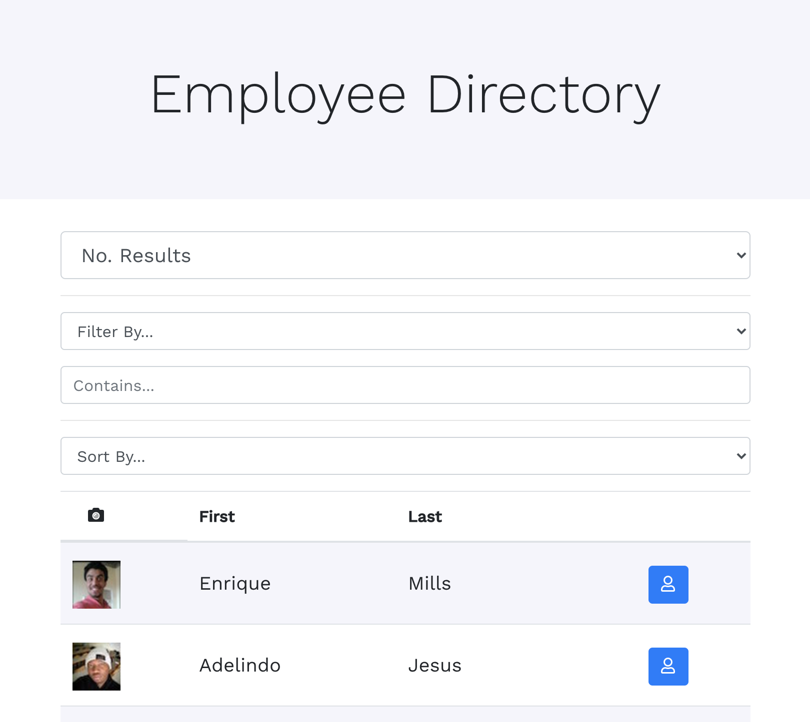
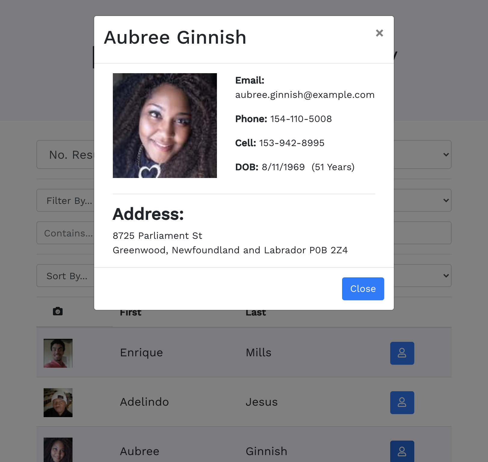
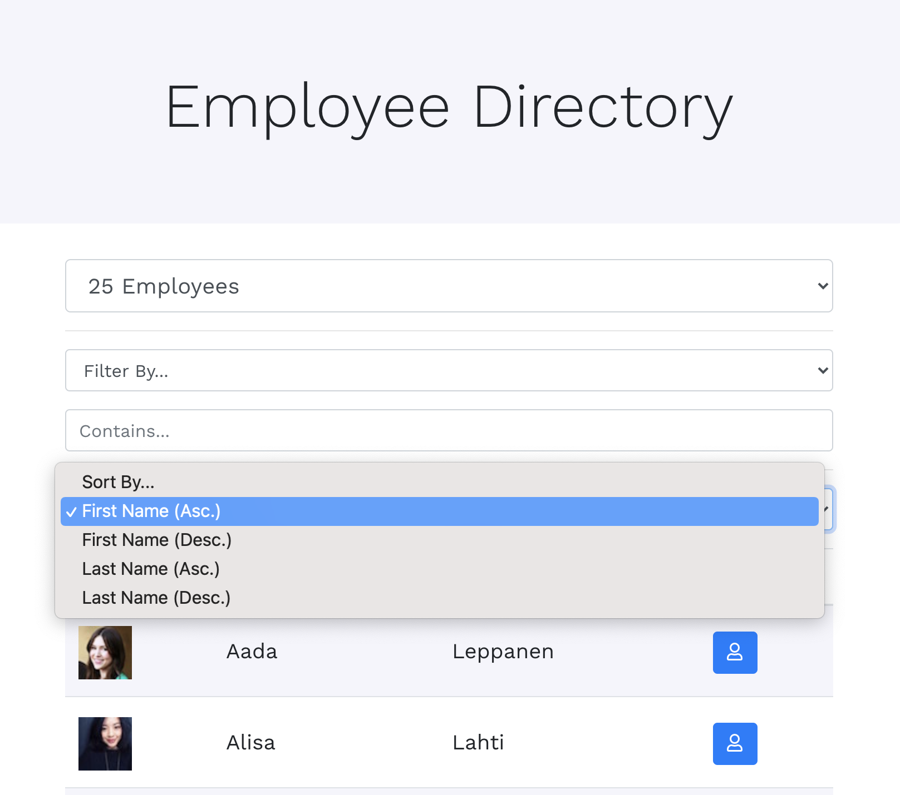

# React Employee Directory

## Deployed Application

[React Employee Directory](https://react-employee-directory-mh.herokuapp.com/)

## Description 

This React application retrieves random user data from randomuser.me and serves as a sample employee database application, which allows a user to filter/sort by name and view more detailed information about an employee.

When the user navigates to the homepage, random users are retrieved from the API. Each time a user changes the number of results to limit, a new call will be made to the API. Using React state and the useState hook, the list of employees is sorted and filtered based on the user's input. When a user selects the detail button for a given employee, a Modal is displayed (using React Bootstrap) with more detailed information about that Employee.

React Router is used to render the main page, which contains the components needed to put the requested information together for the user as well as manage state based on user input. Data is passed to child components using props. This application utilizes functional components and state to handle data changes.

## Features

* React front-end application.
* randomuser.me used to retrieve random data.
* API calls made using axios.
* useState and useEffect hooks manage data.
* Data passed to components via React props.
* Functional Components
* Incorporates Bootstrap/React Bootstrap for styling. 

## Credits

Michael Hanson
* michaeledwardhanson@gmail.com
* [GitHub](https://github.com/mhans003)
* [LinkedIn](https://www.linkedin.com/in/michaeledwardhanson/)

## License 

Licensed under the [MIT License](./LICENSE.txt).